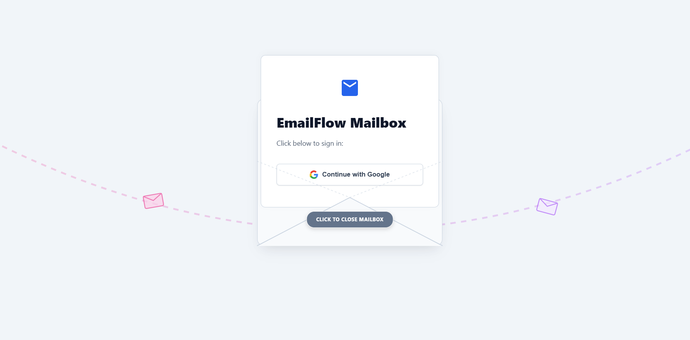
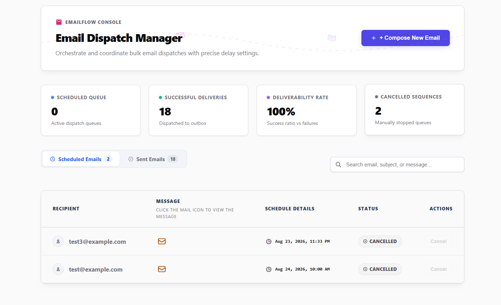
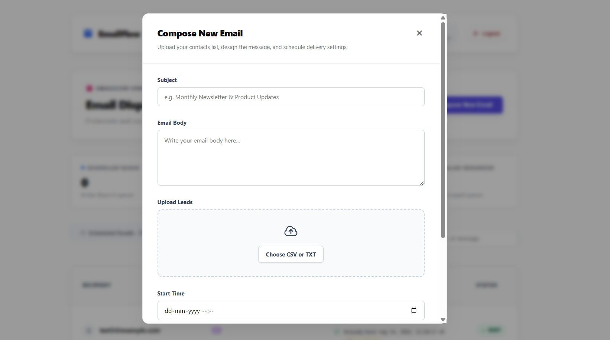

# EmailFlow 📧

<<<<<<< HEAD
A full-stack email scheduling application built for the ReachInbox Software Development Intern assignment.

## Features

- Google OAuth login
- Schedule emails
- Upload CSV/TXT email lists
- View Scheduled and Sent emails
- Shows scheduled time and actual sent time
- BullMQ + Redis for background scheduling
- PostgreSQL for storing email data
- Ethereal Email for testing
- No cron jobs

## Tech Stack

React + TypeScript | Express + TypeScript | PostgreSQL | Redis | BullMQ | Ethereal Email

## Run the Project

### Start Redis

```bash
redis-server
```

### Start Backend

```bash
=======
A full-stack email scheduling application.

## Features

**Backend**
- BullMQ + Redis delayed email scheduling
- PostgreSQL email storage
- Persistent jobs after restart
- Configurable concurrency, delay and hourly rate limit
- Ethereal SMTP for testing
- No cron jobs

**Frontend**
- Google OAuth login
- Compose email with CSV/TXT upload
- Scheduled and Sent email tables
- Scheduled time, sent time and status

## Tech Stack

React + TypeScript | Express + TypeScript | PostgreSQL | Redis | BullMQ | Nodemailer | Ethereal Email

## Run

Start **Redis** and **PostgreSQL**, then configure the backend `.env` with your database, Redis, Google OAuth and Ethereal SMTP credentials.

```bash
# Backend
>>>>>>> 80005d6 (Update README)
cd backend
npm install
npm run dev
```

<<<<<<< HEAD
### Start Worker

Open another terminal:

```bash
=======
Open another terminal:

```bash
# Worker
>>>>>>> 80005d6 (Update README)
cd backend
npm run worker
```

<<<<<<< HEAD
### Start Frontend

Open another terminal:

```bash
=======
Open another terminal:

```bash
# Frontend
>>>>>>> 80005d6 (Update README)
cd frontend
npm install
npm run dev
```

<<<<<<< HEAD
Open:

```text
http://localhost:5173
```
=======
Open `http://localhost:5173`
>>>>>>> 80005d6 (Update README)

## How It Works

```text
Frontend → Express API → PostgreSQL
<<<<<<< HEAD
                     ↓
               BullMQ + Redis
                     ↓
                   Worker
                     ↓
               Ethereal Email
```

Scheduled jobs are stored in Redis using BullMQ, so cron jobs are not used. Email data and status are stored in PostgreSQL.

## Screenshots

_Add project screenshots here._

---

Created for the ReachInbox Software Development Intern Assignment.
=======
                      ↓
                BullMQ + Redis
                      ↓
                    Worker
                      ↓
                 Ethereal SMTP
```

Emails are stored in PostgreSQL and scheduled as BullMQ delayed jobs. Redis keeps jobs persistent after restarts. The worker uses configurable concurrency and rate limiting; jobs that cannot be sent immediately remain queued for later processing.

## Screenshots

### Login



### Dashboard



### Compose Email


>>>>>>> 80005d6 (Update README)
